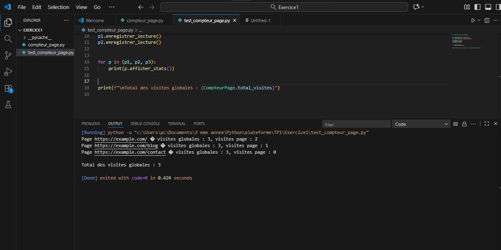
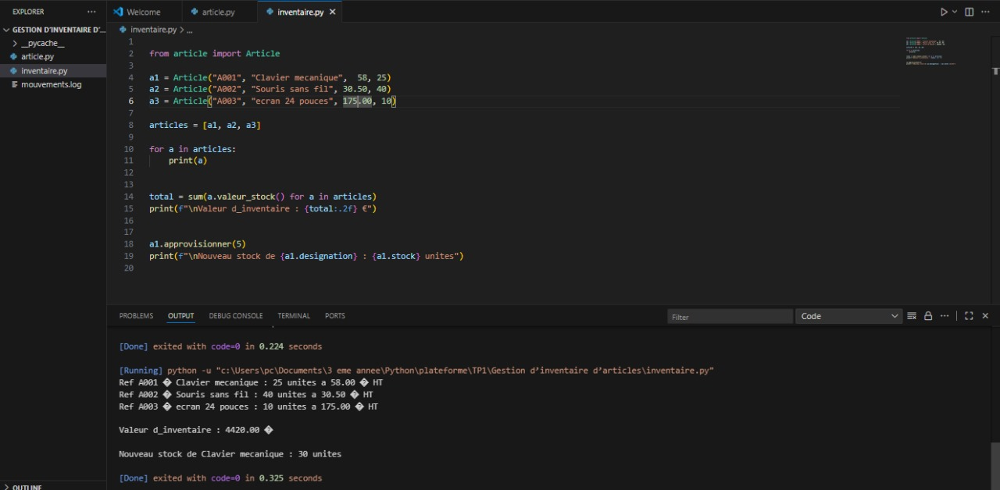
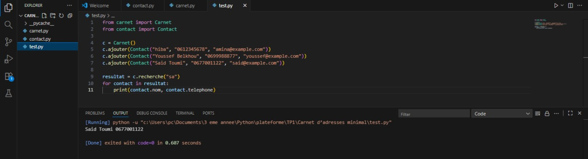
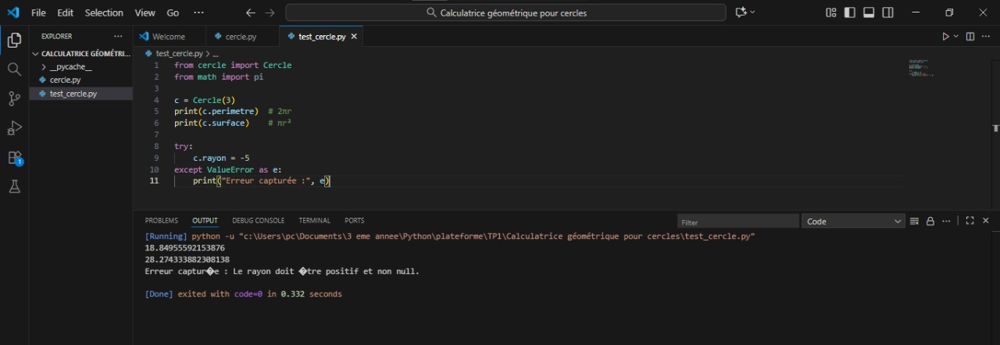
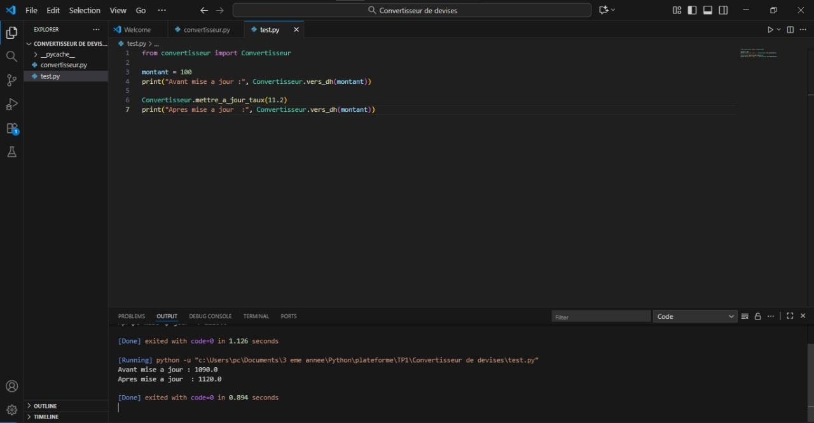

# 🧮 TP 1 : Classes et Objets – Python

Ce projet regroupe plusieurs exercices pratiques sur la **Programmation Orientée Objet (POO)** en Python.  
Chaque exercice illustre un concept fondamental : attributs de classe, encapsulation, propriétés, context manager, etc.  
📁 Dossier des images : `images/`

---

## 🧩 **Exercice 1 — Compteur de visites de pages**
### 🎯 Objectif :
Distinguer **attribut de classe** et **attribut d’instance** à travers un compteur global de visites.

### 📜 Fichier principal :
- `compteur_page.py`
- `test.py`

### 🧠 Structure :
````
Compteur de visites de pages/
│
├── compteur_page.py
├── test.py

````
###Résultat visuel
<div align="center">  <p><em>Figure 1</em></p> </div>

---


## 📦 **Exercice 2 — Gestion d’inventaire d’articles**
### 🎯 Objectif :
Encapsuler les **données métier** et les **calculs de stock** dans une classe `Article`.

### 📜 Fichier principal :
- `article.py`
- `inventaire.py`

### 🧠 Structure :
````
Gestion d’inventaire d’articles/
│
├── article.py
├── inventaire.py

````
###Résultat visuel
<div align="center">  <p><em>Figure 2</em></p> </div>


## 📒 **Exercice 3 — Carnet d’adresses minimal**
### 🎯 Objectif :
Manipuler des **listes d’objets**, des **propriétés**, et la **recherche insensible à la casse**.

### 📜 Fichier principal :
- `contact.py`
- `carnet.py`
- `test.py`

### 🧠 Structure :
````
Carnet d’adresses minimal/
│
├── contact.py
├── carnet.py
├── test.py
````
###Résultat visuel
<div align="center">  <p><em>Figure 3</em></p> </div>

## ⚙️ **Exercice 4 — Calculatrice géométrique pour cercles**
### 🎯 Objectif :
Sécuriser l’accès aux attributs via des **propriétés** avec contrôle et calcul automatique du périmètre et de la surface.

### 📜 Fichier principal :
- `cercle.py`
- `test.py`

### 🧠 Structure :
````
Calculatrice géométrique pour cercles/
│
├── cercle.py
├── test.py

````
###Résultat visuel
<div align="center">  <p><em>Figure 4</em></p> </div>

## 📔 **Exercice 5 — Journal de tâches avec gestion de contexte**
### 🎯 Objectif :
Utiliser le mot-clé **`with`** et les méthodes magiques `__enter__` / `__exit__` pour gérer automatiquement un fichier de journalisation.

### 📜 Fichier principal :
- `journal.py`
- `test.py`

### 🧠 Structure :
````
Journal de tâches avec gestion de contexte/
│
├── journal.py
├── test.py
├── journal.txt
````
###Résultat visuel
<div align="center">  <p><em>Figure 5</em></p> </div>

## 💱 **Exercice 6 — Convertisseur de devises**
### 🎯 Objectif :
Illustrer les **méthodes statiques et de classe** pour la conversion EUR ↔ DH.

### 📜 Fichier principal :
- `convertisseur.py`
- `test.py`

### 🧠 Structure :
````
Convertisseur de devises/
│
├── convertisseur.py
├── test.py
````
###Résultat visuel
<div align="center">  <p><em>Figure 6</em></p> </div>

## 🏁 **Exécution**
Chaque exercice peut être testé individuellement à partir de son fichier de test :
```bash
python test.py
````
